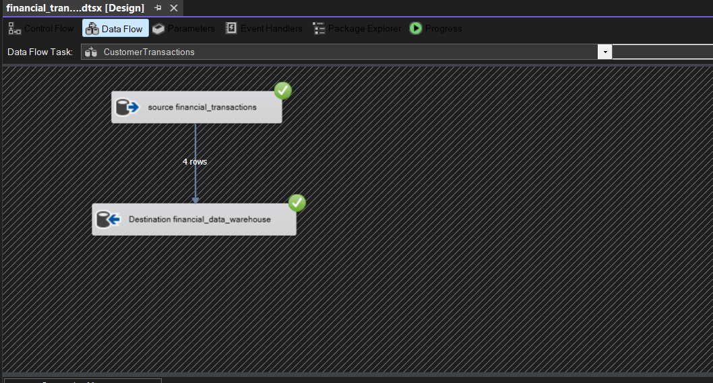
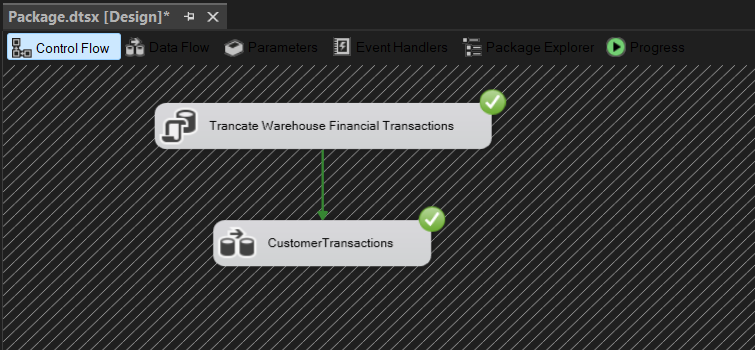
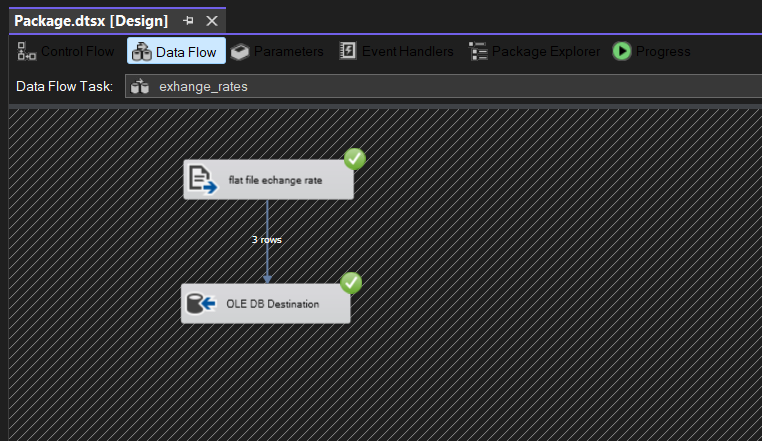
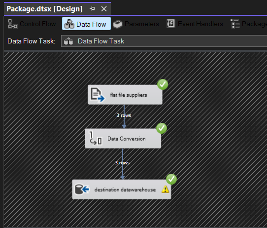
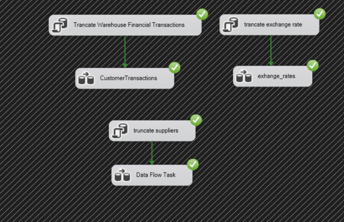
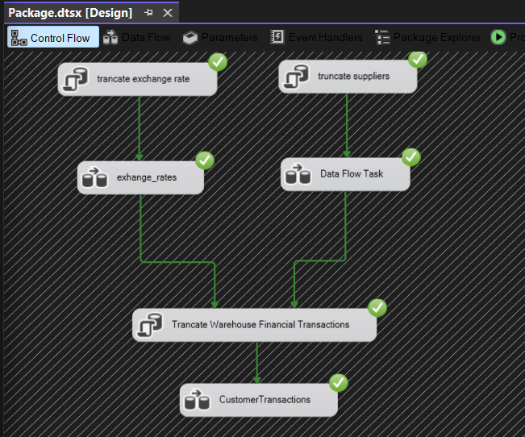
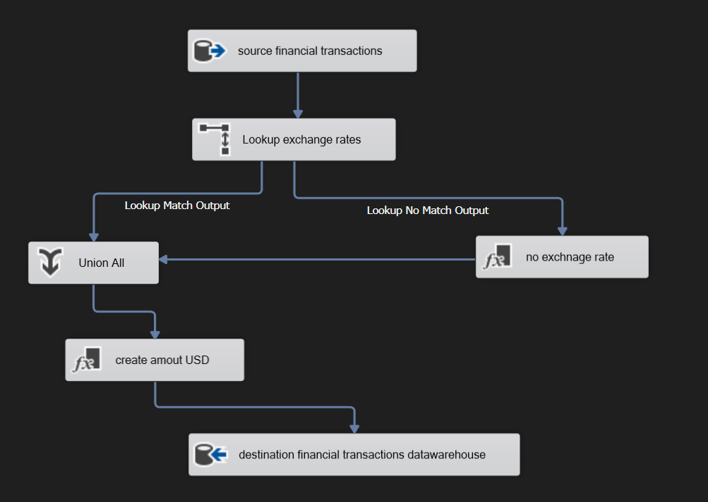

# SSIS_ETL_Project
### Business Request

The business has customer purchase data in local currency, but needs that data converted and needs the Customer contact information with it.

The purchase data is in SQL Server, the currency conversion data is in Excel, and the customer contact information is in a csv file.

 task is to bring this data together in a new SQL Server database for the business.

 first stage Extract:

 adding the data in the data is in SQL Server and connect it to the dataware house destination 

joining the 2 tables at the source to one table using ssis sql command 

problem alert :
we do a full reload the we get an error after trying to re connect again because of the duplicate data 
so we add a truncate sql in the control flow to solve this issue 

adding flat files to our dataware house 
we should always confirm that the data types matches 

adding the 2nd flat file used the data covert to match the data in the dataware house 

looking at the data 
financial_transactions and suppliers; 
looks good 
BUT 
exchange_rates is duplicated 3 times ! 

after truncate the data and runing the control flow 

now we want to do the exchange to usd 
first we add a column in the schma and then edit the flow to be like this 

used a Lookup component to join financial transactions with exchange rates. The Lookup Match Output and Lookup No Match Output streams are immediately merged using a Union All transformation, and the USD amount is then calculated on the combined stream by applying the amount * exchange_rate formula in a subsequent component.

now looking at the data we have the amout_USD 

